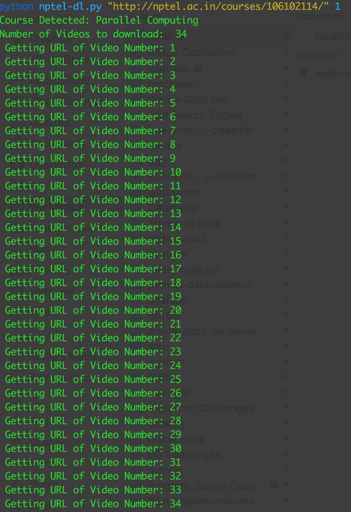
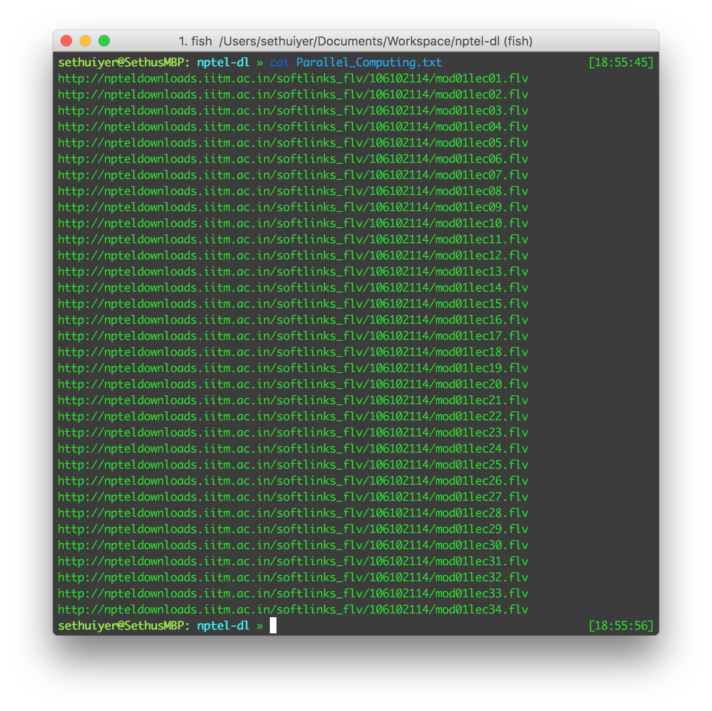
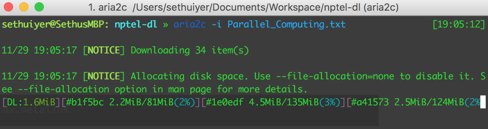

# nptel-dl
Python script to generate text file containing all the URLs of a particular NPTEL course.

#Libraries Required:
1. [Robobrowser](https://github.com/jmcarp/robobrowser)

# Output

And after executing this 

Which then can be downloaded with `wget` or `curl` or `aria2c` etc.

as download is best managed by these clients.
